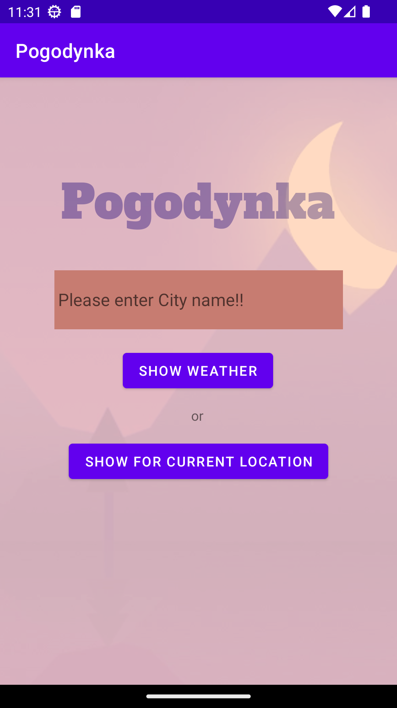
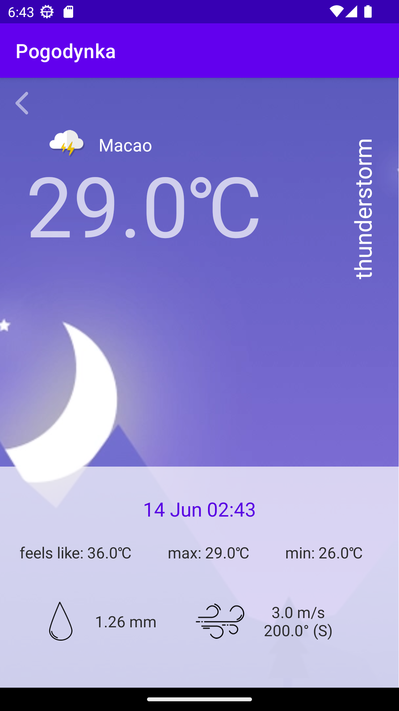

# Pogodynka
 
Android Weather app that uses "Current weather data" API from openweathermap.org to show current weather for given city.

## Start page
Starting the application, opens the Start page (content view "activity_start"), which contains:
- EditText widget where city name should be given;
- Button with text "Show weather" that:
  - gets text from the EditText wiget to set url link used for the API
  - runs method "showWeather" to:
    - get information about weather in given city from the API
    - sets "activity_weather" as content view to show weather data
- Button location with text "Show for current location" that:
  - gets latitude and longitude of current location to set url link used for the API
  - runs method "showWeather" to:
    - get information about weather in current location from the API
    - sets "activity_weather" as content view to show weather data
      
If city name doesn't been given (empty string) or it doesn't get recognised the EditText changes color and it's hint changes to "Please enter City name!!"

 | 
:-------------------------:|:-------------------------:

## Weather page
After successfully using given city to get current weather data, the data is shown on Weather page (content view "activity_wether"). 
Data that is shown:
- City name that was given
- Temperature
- Weather condition (rainny, snowy, clear sky etc.) in form of description on the side and icon beside city name
- Current date and time (used as well to determine time of the day)
- Temperature parameter accounts for the human perception of weather
- Minimum temperature
- Maximum temperature
- Wind speed and direction
- Rain valume for the last hour

 |  
:-------------------------:|:-------------------------:

The app also allows the user to go back to the Start page to view weather for another city.
